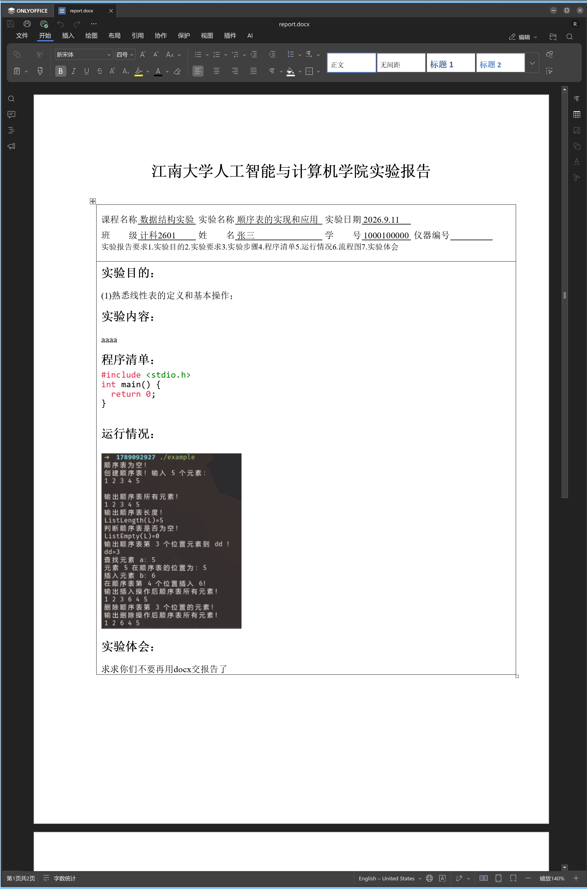

# 江南大学计算机学院实验报告 Typst 模板

这是一个基于 [Typst](https://typst.app/) 的江南大学人工智能与计算机学院实验报告模板。模板支持导出 PDF，并通过 `typ2docx` 将报告转换为可编辑的 DOCX 文件。旨在减少使用 Word 类软件排版时所浪费的时间，并且 AI Agent Friendly。

仓库同时是一个可供 Codex 使用的 skill。安装后，可以让 Codex 根据实验材料创建、填写、修改并导出符合本模板版式的实验报告。

## 预览



## 项目结构

```text
.
├── report.typ                 # 报告源文件，主要编辑此文件
├── report.pdf                 # PDF 导出结果
├── report.docx                # DOCX 导出结果
├── SKILL.md                   # Codex skill 的入口和工作流程
├── Makefile                   # 常用构建命令
├── scripts/typ2docx-safe.py   # DOCX 转换和版式修复脚本
└── assets/                    # 报告中使用的图片等资源
```

## 安装为 Codex Skill

### 使用 Skill Installer

在 Codex 中输入下面的提示词，并将 `<仓库 URL>` 替换为本仓库的 Git 地址：

```text
$skill-installer 请从 <仓库 URL> 安装 jnu-cs-lab-report-typst skill
```

### 手动安装

Codex 会从用户目录的 `~/.agents/skills` 中发现本地 skill。可以直接把仓库克隆到该目录：

```bash
mkdir -p ~/.agents/skills
git clone <仓库 URL> ~/.agents/skills/jnu-cs-lab-report-typst
```

如果已经在本地克隆了本仓库，也可以在仓库根目录创建符号链接，便于后续开发和更新：

```bash
mkdir -p ~/.agents/skills
ln -s "$(pwd)" ~/.agents/skills/jnu-cs-lab-report-typst
```

Codex 通常会自动发现新安装的 skill；如果没有出现，请重启 Codex。可通过 `/skills` 查看，或直接调用：

```text
$jnu-cs-lab-report-typst 根据这些实验要求和代码生成实验报告，并导出 PDF 和 DOCX。
```

安装目录和发现规则参见 [OpenAI 官方文档：Build skills](https://developers.openai.com/codex/skills)。

## 快速开始

### 环境要求

- [Typst](https://github.com/typst/typst)
- Python 3.10 或更高版本
- [uv](https://docs.astral.sh/uv/)（用于自动准备 DOCX 转换依赖）
- 可用的中文字体，例如宋体（`SimSun`）

只生成 DOCX：

```bash
make docx
```

生成 PDF 和 DOCX：

```bash
make all
```

清理生成文件：

```bash
make clean
```

也可以直接使用 Typst 编译：

```bash
typst compile report.typ report.pdf
```

## 编辑报告

打开 `report.typ`，在“可编辑内容”区域修改以下字段和正文：

- 课程名称、实验名称、实验日期
- 班级、姓名、学号、仪器编号
- 实验目的、实验内容、程序清单
- 运行情况和实验体会

程序清单使用 Markdown 风格的代码围栏，例如：

````typst
#let program_list = [
  ```c
  #include <stdio.h>

  int main(void) {
    return 0;
  }
  ```
]
````

报告中的图片使用相对于项目根目录的路径，例如：

```typst
#image("assets/example.png", width: 80%)
```

如果修改了报告版式或正文结构，建议同时检查 PDF 和 DOCX 的分页、字体、表格边框及图片位置。

## 常用命令

```text
make pdf    编译 report.typ，生成 report.pdf
make docx   根据 PDF 生成 report.docx，并恢复可编辑表头布局
make all    依次生成 PDF 和 DOCX
make clean  删除生成文件及转换缓存
make help   查看命令说明
```

DOCX 导出会通过 `uv` 临时准备 `typ2docx`、`pygments` 和相关 Python 依赖。首次执行时可能需要联网下载依赖。

## 许可证

本项目采用 MIT License，详见 [LICENSE](LICENSE)。
